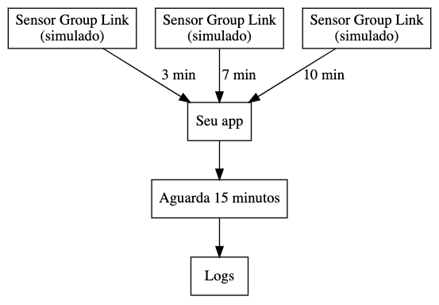

# Desafio Group Link iOS

## Objetivo
- O desafio se trata de um aplicativo exemplo com dados gerados randomicamente
- O aplicativo não precisa ser necessáriamente terminado, vamos avaliar sua qualidade de código e critérios aqui documentados.

## Contexto
Seu aplicativo deste desafio deve conter uma classe para delegar leituras de sensores, a cada intervalo aleatório ela recebe a demanda de um sinal de um sensor Group Link, a cada 15 minutos sua aplicação deve enviar um log com a consolidação de todos os sinais recebidos.

## Arquitetura


### Requisitos
- Todos os sinais são aleatórios e simulados na sua aplicação do teste
- Deve simular recepção de sinais aleatórios em intervalos aleatórios
- Deve gerar um JSON para sair no log da aplicação a cada 15 minutos
- Cada sensor (que você vai simular o sinal) deverá possuir um ID aleatório (sensorID) para identificar cada um

### Especificações
- JSON enviado possui:
  - mobileID: identificação gerada do celular que a aplicação foi instalada
  - sensorID: identificação do sensor capturado (randomico)
  - Objeto tracks: cada sinal deve possuir força do sinal (signalForce), direção do sinal (direction) e objeto de localização (location)

### Formato para enviar (exibir no log da aplicação)
```
{
  "sensorID":"WER23131FFFF11",
  "mobileID:"323DDDDNJHTO234",
  "tracks": [
    { 
      "signalForce":0.23,
      "direction":0.531,
      "location": { "lat":-45.3232311, "lon":20.233111 }
    },
    { 
      "signalForce":0.51,
      "direction":0.211,
      "location": { "lat":-45.3232311, "lon":20.233111 }
    }
  ]
}
```
## Especificações Técnicas
- **Plataforma suportada:** iOS 13+
- **Linguagem:** Swift
- **Idioma de escrita do código:** Inglês

## Critérios de avaliação
 - Qualidade de escrita do código
 - Organização do projeto
 - Lógica da solução implementada
 - Camada de persistência
 
## Instruções de entrega
 1. Crie um fork do repositório no seu GitHub
 2. Faça o push do código desenvolvido no seu Github
 3. Inclua um arquivo chamado COMMENTS.md explicando
	 - Explicação rápida da decisão da arquitetura utilizada e o porquê
	 - Lista de bibliotecas de teceiros utilizadas
	 - O que você melhoraria se tivesse mais tempo
	 - Quais requisitos obrigatórios não foram entregues e o porquê
 4. Informe ao recrutador quando concluir o desafio junto com o link do repositório
